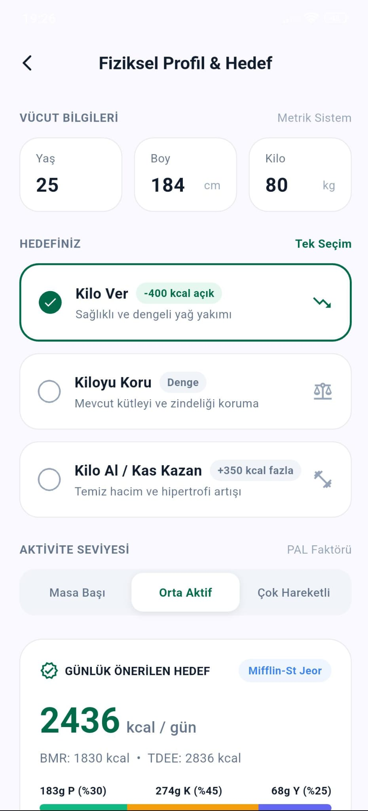

# NutriLens 🥗

NutriLens, kullanıcıların tükettikleri öğünlerin fotoğraflarını çekerek kalori ve makro besin değerlerini (Protein, Karbonhidrat, Yağ) yapay zeka ile analiz eden, aynı zamanda barkod okuma ve günlük beslenme takibi sunan mobil ve backend projesidir.

---

## 📱 Ekran Görüntüleri

<div align="center">

### 1. Açılış & Kimlik Doğrulama
| Karşılama Ekranı | Giriş Yap |
| :---: | :---: |
|  |  |

### 2. Ana Sayfa (Açık & Koyu Tema)
| Açık Tema | Koyu Tema |
| :---: | :---: |
|  |  |

### 3. Yapay Zeka Yemek Analizi & Barkod Taraması
| Yapay Zeka Analiz Sonucu | Barkod Tarayıcı |
| :---: | :---: |
|  |  |

### 4. Fiziksel Profil & Ayarlar
| Fiziksel Profil & Hedefler | Ayarlar Ekranı |
| :---: | :---: |
|  |  |

</div>

---

## 🚀 Öne Çıkan Özellikler

- 📸 **Görsel Tabanlı Besin Analizi**: Yemek fotoğrafından yemek türü, porsiyon gramajı ve kalori/makro değerlerini Google Gemini 1.5 Flash Vision modeli ile anında hesaplar.
- 🔍 **Barkod Taraması**: Paketli gıdaların barkodunu tarayarak besin veritabanından kalori ve içerik bilgilerini getirir.
- 🎯 **Kişiselleştirilmiş Kalori Hedefleri**: Mifflin-St Jeor formülünü kullanarak kullanıcının yaş, boy, kilo, cinsiyet ve aktivite seviyesine göre BMR, TDEE ve günlük hedef kalori/makro dağılımını (Protein %30, Karbonhidrat %45, Yağ %25) hesaplar.
- 💧 **Günlük Su ve Öğün Takibi**: Günlük su tüketim takibi ve 7 günlük geçmiş beslenme günlüğü inceleme olanağı sunar.
- 🌙 **Dinamik Koyu / Açık Tema**: Gece kullanımı için tasarlanmış slate renk paletine sahip koyu tema desteği.

---

## 🛠️ Teknoloji Yığını

### Mobil Uygulama (`mobile/`)
- **Framework**: Flutter (Dart)
- **State Management**: Provider
- **HTTP Client**: Dio
- **Tasarım & UI**: Custom Material 3 Design System, Google Fonts (Inter)

### Backend Servisi (`backend/`)
- **Framework**: Python 3.10+ & FastAPI
- **Yapay Zeka Servisi**: Google Gemini API (`google-genai` / Gemini 1.5 Flash)
- **Veritabanı**: MongoDB Atlas & Motor (Async Drivers)
- **Kimlik Doğrulama**: JWT (JSON Web Tokens) & Passlib (Bcrypt Password Hashing)

---

## 🏗️ Proje Dizin Yapısı

```text
nutriLens/
├── mobile/                        # Flutter Mobil Uygulama
│   ├── lib/
│   │   ├── core/                  # Tema ve API İstemcisi
│   │   ├── models/                # Veri Modelleri (User, Food, Diary)
│   │   ├── providers/             # Uygulama Durum Yönetimi (AppState)
│   │   └── views/                 # Ekran Arayüzleri (Dashboard, Profile, Result, Scanner)
│   └── pubspec.yaml
│
├── backend/                       # FastAPI Backend Servisi
│   ├── app/
│   │   ├── core/                  # Yapılandırma ve Veritabanı Bağlantıları
│   │   ├── models/                # Pydantic Veri Şemaları
│   │   └── modules/               # Vision AI, Barkod ve Hesaplayıcı Modülleri
│   ├── main.py
│   ├── requirements.txt
│   └── .env.example
│
├── ss/                            # Ekran Görüntüleri Kaynağı
└── docs/
    └── screenshots/               # Dokümantasyon Ekran Görüntüleri
```

---

## ⚡ Yerel Kurulum & Çalıştırma

### 1. Backend Kurulumu
```bash
cd backend
python -m venv venv

# Windows:
venv\Scripts\activate
# Linux/macOS:
source venv/bin/activate

pip install -r requirements.txt
```

Ortam değişkenlerini ayarlamak için `.env.example` dosyasını `.env` olarak kopyalayın ve kendi API anahtarlarınızı girin:
```bash
cp .env.example .env
```

Backend sunucusunu başlatın:
```bash
uvicorn app.main:app --reload --host 0.0.0.0 --port 8000
```

### 2. Mobil Uygulama Kurulumu
```bash
cd mobile
flutter pub get
flutter run
```

---

## 📄 Lisans
Bu proje [MIT Lisansı](LICENSE) altında lisanslanmıştır.
