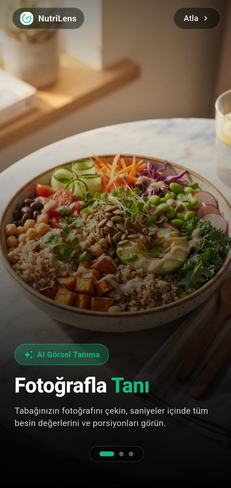
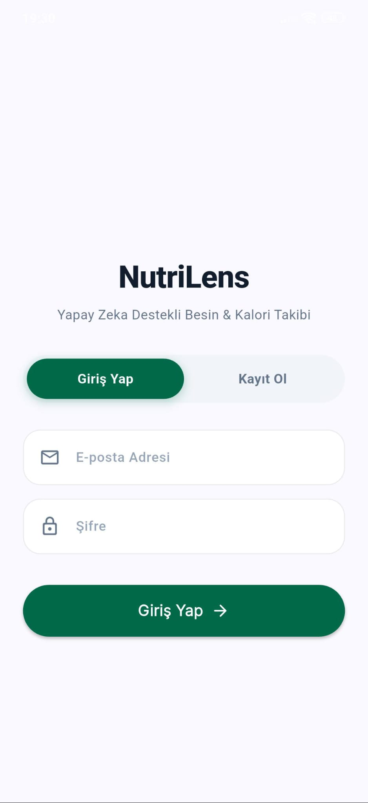
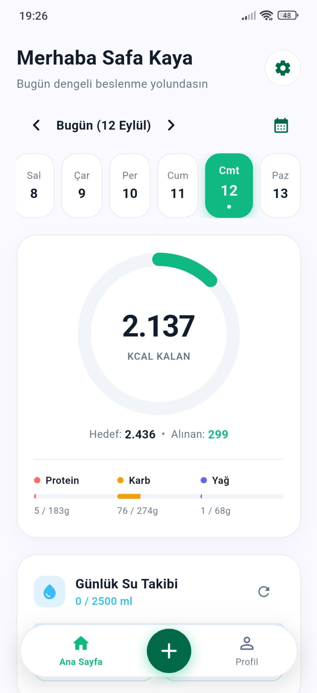
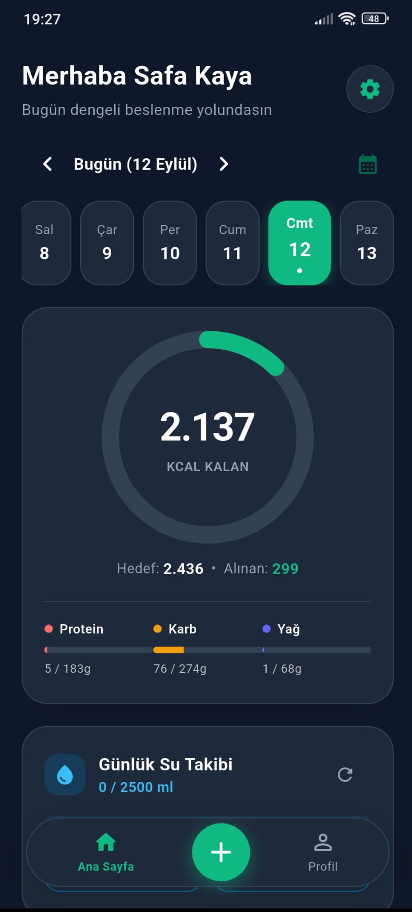
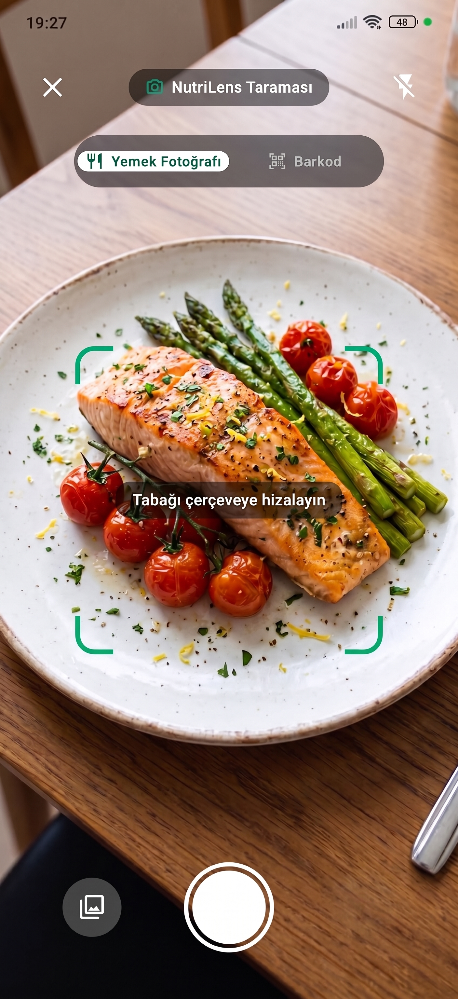
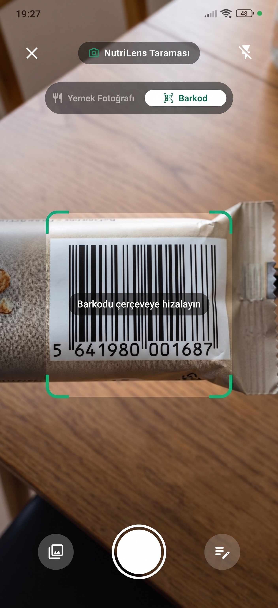
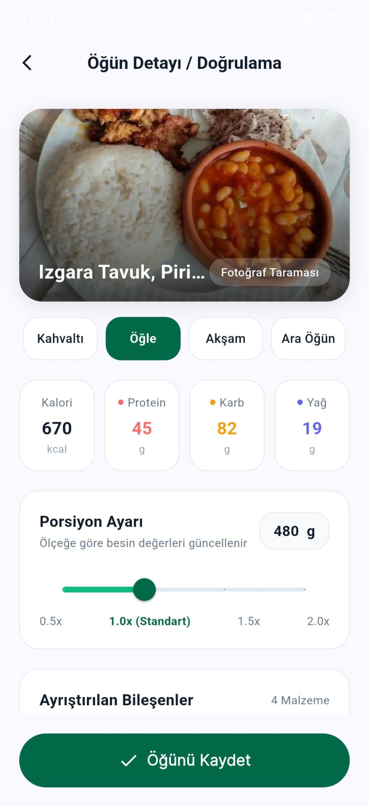
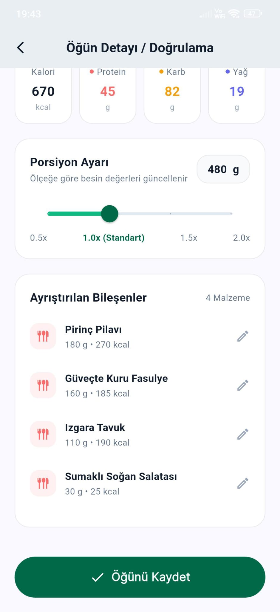
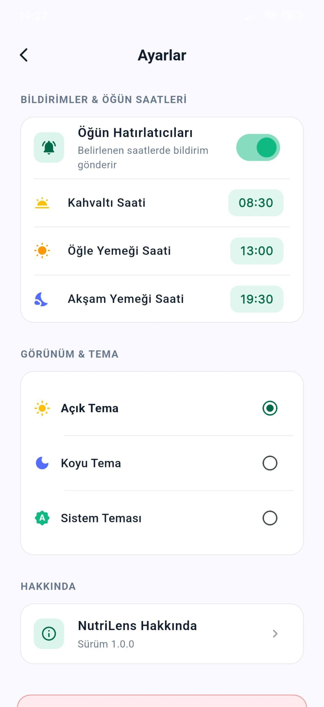

# NutriLens

NutriLens, bireylerin günlük beslenme alışkanlıklarını ve kalori takiplerini zahmetsiz bir şekilde yönetebilmeleri amacıyla geliştirilmiş akıllı bir beslenme ve sağlık asistanıdır. Geleneksel beslenme uygulamalarında yaşanan manuel veri girişi zorluğunu ortadan kaldırarak, tabağınızdaki yemeğin tek bir fotoğrafı ile porsiyon, kalori ve temel makro besin değerlerini (Protein, Karbonhidrat, Yağ) otomatik olarak analiz eder.

Paketli gıdalar için entegre barkod tarama desteği sunan uygulama, kullanıcının fiziksel yapısını (yaş, boy, kilo, aktivite seviyesi) esas alarak Mifflin-St Jeor formülüyle kişiye özel günlük BMR, TDEE ve makro hedefleri belirler. Tüketilen su miktarından geçmiş beslenme özetlerine kadar tüm süreç, açık ve koyu tema seçenekleriyle modern ve sezgisel bir arayüz üzerinden takip edilebilir.

---

## Ekran Görüntüleri

<div align="center">

### 1. Açılış & Kimlik Doğrulama
| Karşılama Ekranı | Giriş Yap |
| :---: | :---: |
|  |  |

### 2. Ana Sayfa (Açık & Koyu Tema)
| Açık Tema | Koyu Tema |
| :---: | :---: |
|  |  |

### 3. Yemek & Barkod Tarama
| Fotoğrafla Yemek Tarama | Barkod Tarayıcı |
| :---: | :---: |
|  |  |

### 4. Yapay Zeka Yemek Analiz Sonucu
| Analiz Sonucu & Makrolar | Besin & İçerik Detayları |
| :---: | :---: |
|  |  |

### 5. Fiziksel Profil & Ayarlar
| Fiziksel Profil & Hedefler | Ayarlar Ekranı |
| :---: | :---: |
|  |  |

</div>

---

## Öne Çıkan Özellikler

- **Görsel Tabanlı Besin Analizi**: Yemek fotoğrafından yemek türü, porsiyon gramajı ve kalori/makro değerlerini Google Gemini Vision AI modeli ile anında hesaplar.
- **Barkod Taraması**: Paketli gıdaların barkodunu tarayarak besin veritabanından kalori ve içerik bilgilerini getirir.
- **Kişiselleştirilmiş Kalori Hedefleri**: Mifflin-St Jeor formülünü kullanarak kullanıcının yaş, boy, kilo, cinsiyet ve aktivite seviyesine göre BMR, TDEE ve günlük hedef kalori/makro dağılımını hesaplar.
- **Günlük Su ve Öğün Takibi**: Günlük su tüketim takibi ve geçmiş beslenme günlüğü inceleme olanağı sunar.
- **Dinamik Koyu ve Açık Tema**: Gece kullanımı için tasarlanmış slate renk paletine sahip koyu tema desteği.

---

## Teknoloji Yığını

### Mobil Uygulama (`mobile/`)
- **Framework**: Flutter (Dart)
- **State Management**: Provider
- **HTTP Client**: Dio
- **Tasarım & UI**: Custom Material 3 Design System, Google Fonts (Inter)

### Backend Servisi (`backend/`)
- **Framework**: Python 3.10+ & FastAPI
- **Yapay Zeka Servisi**: Google Gemini Vision AI (`google-genai`)
- **Veritabanı**: MongoDB Atlas & Motor (Async Drivers)
- **Kimlik Doğrulama**: JWT (JSON Web Tokens) & Passlib (Bcrypt Password Hashing)

---

## Proje Dizin Yapısı

```text
nutriLens/
├── mobile/                        # Flutter Mobil Uygulama
│   ├── lib/
│   │   ├── core/                  # Tema ve API İstemcisi
│   │   ├── models/                # Veri Modelleri (User, Food, Diary)
│   │   ├── providers/             # Uygulama Durum Yönetimi (AppState)
│   │   └── views/                 # Ekran Arayüzleri (Dashboard, Profile, Result, Scanner)
│   └── pubspec.yaml
│
├── backend/                       # FastAPI Backend Servisi
│   ├── app/
│   │   ├── core/                  # Yapılandırma ve Veritabanı Bağlantıları
│   │   ├── models/                # Pydantic Veri Şemaları
│   │   └── modules/               # Vision AI, Barkod ve Hesaplayıcı Modülleri
│   ├── main.py
│   ├── requirements.txt
│   └── .env.example
│
└── docs/
    └── screenshots/               # Dokümantasyon Ekran Görüntüleri
```

---

## Yerel Kurulum ve Çalıştırma

### 1. Backend Kurulumu
```bash
cd backend
python -m venv venv

# Windows:
venv\Scripts\activate
# Linux/macOS:
source venv/bin/activate

pip install -r requirements.txt
```

Ortam değişkenlerini ayarlamak için `.env.example` dosyasını `.env` olarak kopyalayın ve kendi API anahtarlarınızı girin:
```bash
cp .env.example .env
```

Backend sunucusunu başlatın:
```bash
uvicorn app.main:app --reload --host 0.0.0.0 --port 8000
```

### 2. Mobil Uygulama Kurulumu
```bash
cd mobile
flutter pub get
flutter run
```

---

## Lisans
Bu proje [MIT Lisansı](LICENSE) altında lisanslanmıştır.
